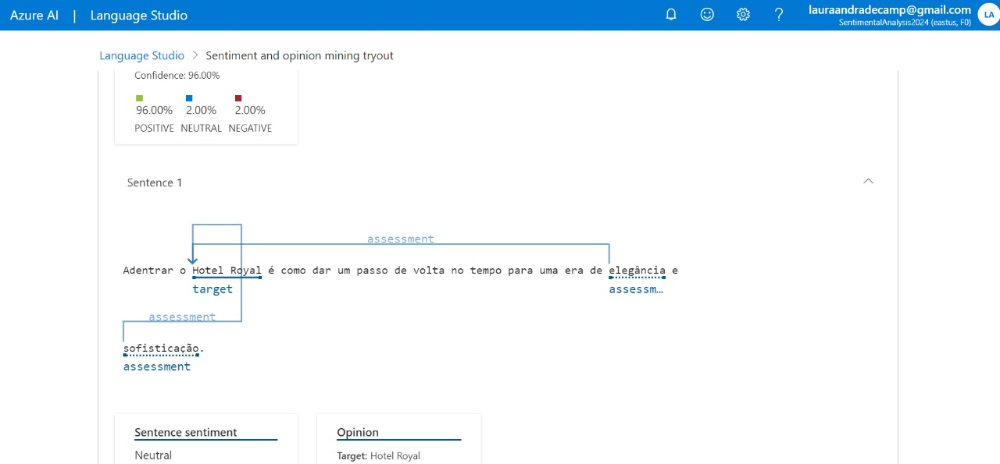
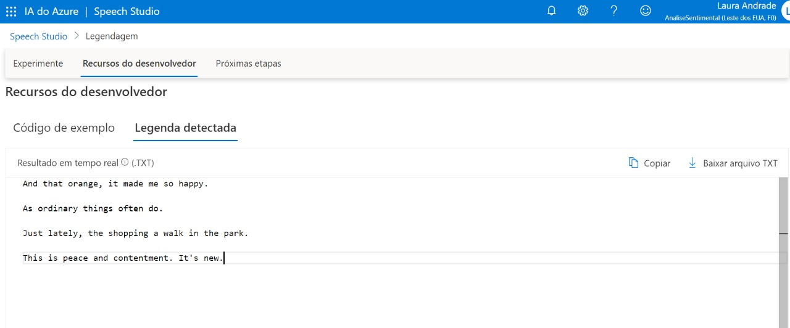

# Desafio Análise de Sentimentos com Language Studio
Desafio para utilizar texto como fonte de dados no portal da Azure através de ferramentas encontradas no Language Studio. Utilizando a funcionalidade "analisar sentimento e minerar opiniões" com o intuito de analisar a positividade/negatividade em sentimentos da mensagem, podendo ser feita a averiguação em sentenças isoladas de texto.

## Descrição da minha experiência
Seguindo a orientação das aulas da [Digital Innovation One (Dio)](https://digitalinnovation.one/) vinculada à certificação AI-900, fui desafiada a utilizar um texto - nesse caso eu gerei um texto no chat de Inteligência Artificial [ChatGPT](https://chat.openai.com)-, utilizando das ferramentas disponibilizadas no site. Depois de criar meu recurso de linguagem, finalizei o prompt com minha mensagem, escolhi a linguagem em vigor e então iniciei a análise. Na pasta "inputs" você encontrará as saídas de acordo com a análise feita e as conclusões acerca de meu texto. Abaixo vou adicionar alguns prints acerca da minha experiência utilizando a ferramenta:

Também utilizei o Speech Studio para transcrever meu áudio em inglês, ou seja, a IA da ferramenta é capaz de reconhecer as palavras até de não-nativos, considerando a acentuação individual:

## Funcionalidades

1. **Análise de Sentimento::**
   - A análise de sentimento envolve determinar o sentimento (positivo, negativo ou neutro) expresso em um pedaço de texto. Você pode realizar análise de sentimento usando o Language Studio aproveitando modelos pré-treinados ou treinando seu próprio modelo em conjuntos de dados rotulados de análise de sentimento. Os modelos GPT da OpenAI podem ser ajustados para tarefas de análise de sentimento, nos quais você fornece exemplos de texto juntamente com seus rótulos de sentimento correspondentes durante o processo de ajuste.

2. **Mineração de Opinião:**
   -  A mineração de opinião, também conhecida como análise de sentimento em um nível mais granular, envolve extrair opiniões ou sentimentos sobre aspectos ou entidades específicas de um texto. Essa tarefa frequentemente envolve uma análise mais sutil do que a análise de sentimento tradicional. Você pode realizar mineração de opinião usando o Language Studio combinando técnicas de processamento de linguagem natural (PLN), aprendizado de máquina e extração de informações. Isso pode envolver identificar entidades ou aspectos mencionados no texto e, em seguida, determinar o sentimento associado a cada entidade ou aspecto.

## Recursos Adicionais

- Documentações importantes para realizar a análise: [Guide to Language Studio](https://microsoftlearning.github.io/mslearn-ai-fundamentals/Instructions/Labs/06-text-analysis.html)

- Contribuições:
Contribuições são bem-vindas! Sinta-se à vontade para abrir problemas ou enviar solicitações de pull para melhorar este projeto.

Este projeto foi oferecido como parte do processo para obtenção da certificação AI-900 da [Digital Innovation One (Dio)](https://digitalinnovation.one/) em parceria com a Microsoft!
